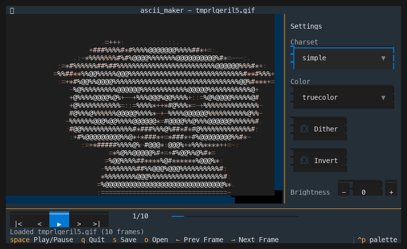
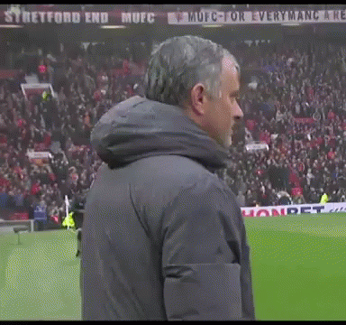
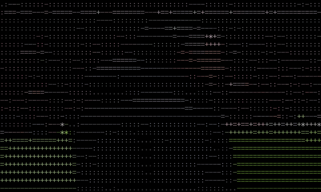
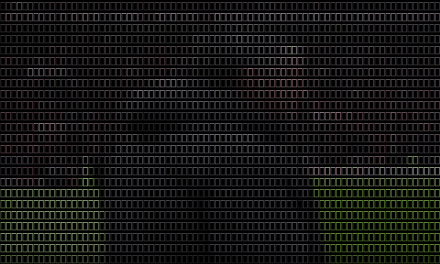
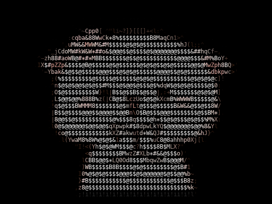

# ascii_maker

Convert GIF/MP4 to ASCII art or Floyd-Steinberg dithered animations. Includes an interactive TUI with live preview, playback controls, and a pipe-friendly CLI for scripting.

## Demo

### Interactive TUI



### Output Samples

Source GIF:



**Simple charset** (`--charset simple`):



**Braille charset** (`--charset braille`):



**Detailed charset + Floyd-Steinberg dithering** (`--charset detailed --dither`):



## Install

```bash
# Clone and set up
git clone https://github.com/serrrfirat/ascii_maker.git
cd ascii_maker
python3 -m venv .venv
source .venv/bin/activate
pip install -e .
```

Requires Python 3.11+.

## Usage

### Interactive TUI

```bash
# Local file
ascii-maker input.gif

# URL
ascii-maker https://media1.tenor.com/m/6r9EhGRfHVQAAAAC/jose-mourinho-ssh.gif
```

**Keybindings:**

| Key | Action |
|-----|--------|
| `Space` | Play / Pause |
| `←` `→` | Step frame |
| `s` | Save output |
| `c` | Copy frame to clipboard |
| `o` | Open file |
| `Tab` | Toggle settings panel |
| `q` | Quit |

### Headless CLI

```bash
ascii-maker convert input.gif -o output.gif --charset simple --dither
ascii-maker convert input.mp4 -o output.mp4 --charset braille --color truecolor
ascii-maker convert https://example.com/animation.gif -o output.gif
```

### JSON Mode (for AI agents / scripts)

```bash
ascii-maker convert input.gif -o output.gif --json
```

```json
{
  "status": "success",
  "input": "/path/to/input.gif",
  "output": "/path/to/output.gif",
  "settings": { "charset": "simple", "color": "truecolor", "dither": false, "width": 80, "height": 24 },
  "metadata": { "input_frames": 48, "output_frames": 48, "fps": 12.0, "input_format": "gif", "output_format": "gif" }
}
```

Errors go to stderr as JSON with exit code 1.

### Options

| Flag | Values | Default |
|------|--------|---------|
| `--charset` | `simple` `detailed` `blocks` `braille` | `simple` |
| `--color` | `none` `256` `truecolor` | `truecolor` |
| `--dither` | flag | off |
| `--brightness` | -100 to 100 | 0 |
| `--contrast` | 0 to 200 | 100 |
| `--invert` | flag | off |
| `--width` | int | 80 |
| `--height` | int | 24 |
| `--font-size` | int | 14 |

## How It Works

```
Input GIF/MP4 (or URL)
  → Reader (lazy frame iterator, handles GIF disposal compositing)
  → Processor (resize to terminal dims → grayscale → brightness/contrast → dither or char-map → colorize)
  → Terminal Preview (Textual TUI) or File Writer (render text to image → save GIF/MP4)
```

- **Resize before processing** — dithering at 200x60 is <5ms vs seconds at full resolution
- **4 charsets** — simple (10 chars), detailed (70 chars), Unicode blocks, braille (2x4 bit-mapped, 256 codepoints)
- **Floyd-Steinberg dithering** — error diffusion with configurable output levels
- **Per-character truecolor** — samples center pixel of each character cell
- **LRU frame cache** — 64 frames keyed by index + settings hash
- **Threaded workers** — frame processing runs off the TUI main thread
